# Нора (последний реверс) - CrimeaCTF-2018

[Файл таска](rev3)

Заранее, предупреждаю, что я не претендую на самое лучшее решение. В некоторых местах возможны более удобные инструменты.

Утилита file говорит нам, что это ELF64:

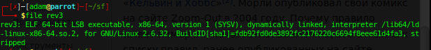

После запуска файла от нас ждут ввода. Попробуем что-то ввести, однако никакого вывода нет.

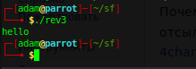

Откроем бинарник в иде и посмотрим на строки.

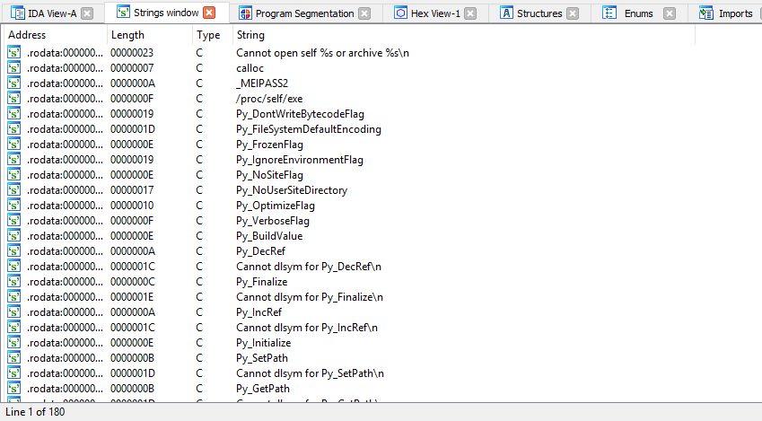

Видим, что здесь каким-то образом используется python. Гуглинг по запросу _MEIPASS2 выдал, что бинарник получен из исходного файла python путем применения утилиты freeze. Значит нам нужно каким-то образом выгрузить код питона из бинарника, причем в бинарнике хранятся код хранится в скомпилированном виде, как в pyc-файлах.

Сначала смотрим в иде, где используются строки, начинающиеся на Py_.

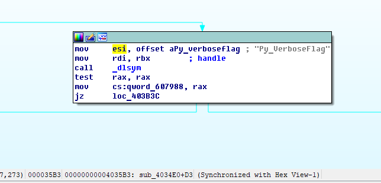

С помощью вызова _dlsym мы подключаем нужные функции в процедуре sub_4034E0. Эта функция вызывалась из фукнции sub_404000 (смотрим, используя перекрестные ссылки). Эта функция в свою очередь вызывается из sub_402D90, где в самом внизу можно обнаружить следующий переход

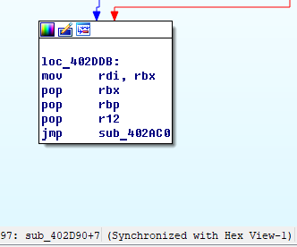

Перейдем по нему

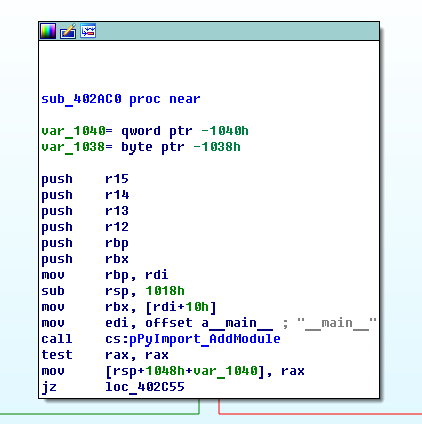

Уже из этой процедуры (sub_402AC0) мы будем доставать скомпилированный код питона

Обращаем внимание на вызов PyMarshal_ReadObjectFromString (ида сама не распознала, что это адрес функции и мне самостоятельно пришлось переименовать, используя граф, где происходил вызов _dlsym) 

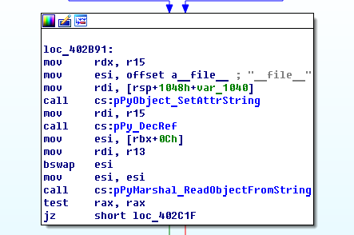

Его адрес 0x0000000000402BB7. Для динамического анализа я не использовал отладчик иды, а отдал предпочтение gdb-peda. Ставим брэйкпонт на этом вызове и запускаем:

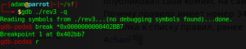

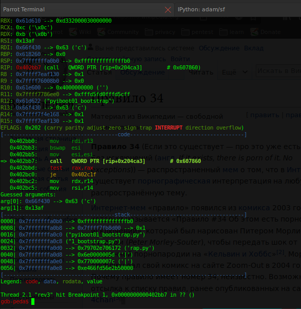

Peda нам показывает аргументы функции. Их два и если посмотреть документацию, то у Py_ PyMarshal_ReadObjectFromString первый это адрес начала данных, а второй – размер.

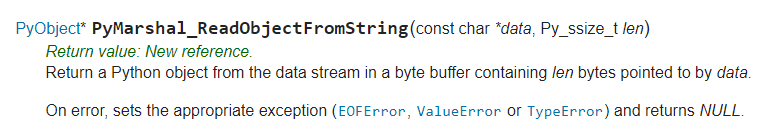

Дампим память и сохраняем где-то полученные байты. Я это делал через своеобразный костыль: скопировал все в notepad++, путем замены с регулярными выражениями убрал адреса,  длинные пробелы и 0x и скопировал в HxD.

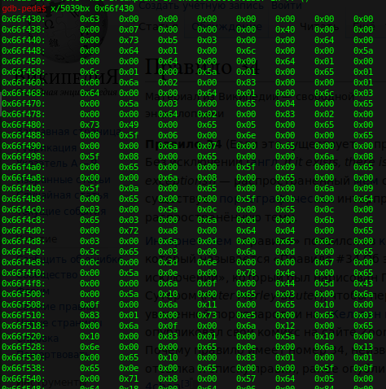

Запускем ipython и вводим в нем следующие команды

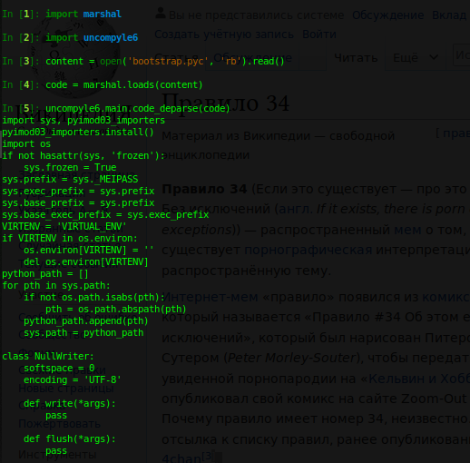

Так мы получили исходный код на питоне. Однако это файл предварительной настройки (boostrap). Сам файл с логикой загружается в следующий раз. Процесс выгрузки байткода из памяти совпадает. 
Исходник с таском

```python
from string import maketrans
if ('|').join([ i.encode('base64').replace('\n', '') for i in ('!').join([ chr(ord(e) ^ ord(' ') - 5) for e in raw_input().translate(maketrans(('TUFaR1RhfQoK').decode('base64'), ('MTQ1OTAyMwoK').decode('base64'))) ]).encode('rot13') ]).encode('base64') == 'ZlE9PXxJUT09fGFnPT18SVE9PXxLUT09fElRPT18ZkE9PXxJUT09fFlBPT18SVE9PXxLZz09fElR\nPT18S2c9PXxJUT09fEtnPT18SVE9PXxLZz09fElRPT18S2c9PXxJUT09fEtnPT18SVE9PXxLZz09\nfElRPT18S2c9PXxJUT09fEtnPT18SVE9PXxLZz09fElRPT18VVE9PXxJUT09fEt3PT18SVE9PXxS\nZz09fElRPT18THc9PXxJUT09fEt3PT18SVE9PXxVUT09fElRPT18UlE9PXxJUT09fFZRPT18SVE9\nPXxVUT09fElRPT18THc9PXxJUT09fEtnPT18SVE9PXxMdz09fElRPT18TGc9PXxJUT09fFJRPT18\nSVE9PXxTQT09fElRPT18SWc9PXxJUT09fEtBPT0=\n':
	print 'You Win!'
```

Чтобы раскодировать немного упростим код:

```python
lst = []
user_input_encoded = raw_input().translate(maketrans(('TUFaR1RhfQoK').decode('base64'), ('MTQ1OTAyMwoK').decode('base64')))
for e in user_input_encoded:
  lst.append( chr(ord(e) ^ ord(' ') - 5) )
s = ('!').join(lst)
s = s.encode('rot13')

lst = []
for i in s:
  lst.append( i.encode('base64').replace('\n', '') )
s2 = ('|').join(lst)
result = s2.encode('base64')
```

Теперь процесс написания декодера упростился

```python
result_1 = 'ZlE9PXxJUT09fGFnPT18SVE9PXxLUT09fElRPT18ZkE9PXxJUT09fFlBPT18SVE9PXxLZz09fElR\nPT18S2c9PXxJUT09fEtnPT18SVE9PXxLZz09fElRPT18S2c9PXxJUT09fEtnPT18SVE9PXxLZz09\nfElRPT18S2c9PXxJUT09fEtnPT18SVE9PXxLZz09fElRPT18VVE9PXxJUT09fEt3PT18SVE9PXxS\nZz09fElRPT18THc9PXxJUT09fEt3PT18SVE9PXxVUT09fElRPT18UlE9PXxJUT09fFZRPT18SVE9\nPXxVUT09fElRPT18THc9PXxJUT09fEtnPT18SVE9PXxMdz09fElRPT18TGc9PXxJUT09fFJRPT18\nSVE9PXxTQT09fElRPT18SWc9PXxJUT09fEtBPT0=\n'.decode('base64')
result_2 = result_1.split('|')
s = ''
for i in result_2:
  s += i.replace('', '\n').decode('base64')
s = s.decode('rot13')

result_3 = s.split('!')
s = ''
for i in result_3:
  s += chr(ord(i) ^ 27)
result_4 = s.translate(maketrans(('MTQ1OTAyMwoK').decode('base64'), ('TUFaR1RhfQoK').decode('base64')))
return result_4
```

Флаг


