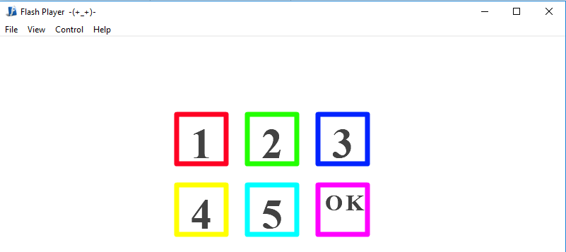
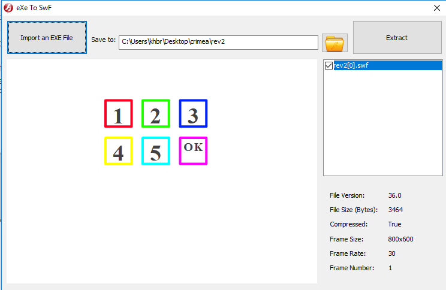
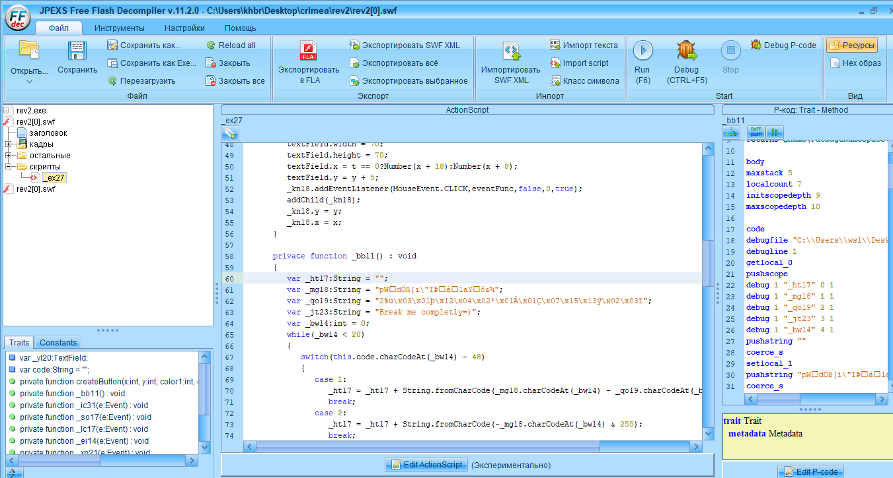
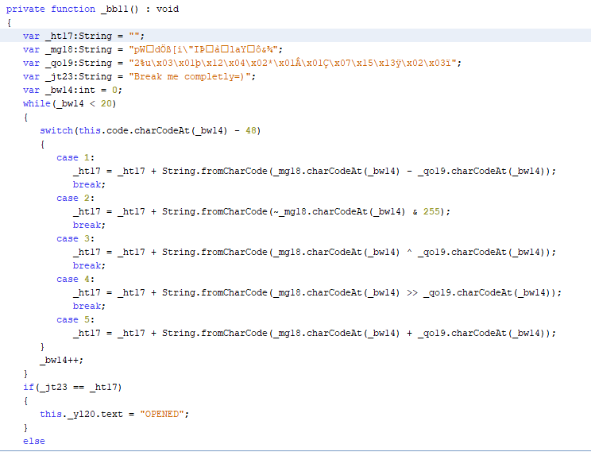

# Третий реверс, Rev2 - CrimeaCTF-2018

[Файл таска](rev2.exe)

Запускаем приложение и видим номерной замок. А еще видим иконку с буквой f (как и иконка самого файла).



Складывается предположение, что это на самом деле flash-приложение в экзешнике. Ищем чем можно извлечь swf из exe.  Я делал через EXEtoSWF (SWF Tools).



Хорошо мы извлекли swf. Теперь нужен flash-декомпилятор. Я использовал JPEXS Free Flash Decompiler.



В коде много испорченных названий переменных. Придется восстанавливать по интерфейсу приложения. Функцию, которая отвечает за открытие замка, декомпилятор назвал _bbll()



Здесь декодер не получится написать, только брутфорс, чтобы совпало последнее условие (_jt23 == _ht17). Так как мой любимый язык python, то я решение написал на нем

```python
#!/usr/bin/env python3

def click1(char1, char2):
	return chr((ord(char1) - ord(char2)) & 255)
	
def click2(char1):
	return chr(~ord(char1) & 255)
	
def click3(char1, char2):
	return chr(ord(char1) ^ ord(char2))
	
def click4(char1, char2):
	return chr((ord(char1) >> ord(char2)) & 255)
	
def click5(char1, char2):
	return chr((ord(char1) + ord(char2)) & 255)


result_string = ""
magic_string_1 = "pWšdÖß[i\"Iޒà“laY†ô&¾"
magic_string_2 = "2%u\x03\x01þ\x12\x04\x02*\x01Â\x01Ç\x07\x15\x13ÿ\x02\x03ï"
password = "Break me completly=)"

	
code = ''	
for i in range(0, 20):
	if click1(magic_string_1[i], magic_string_2[i]) == password[i]:
		code += '1'
		continue
	elif click2(magic_string_1[i]) == password[i]:
		code += '2'
		continue
	elif click3(magic_string_1[i], magic_string_2[i]) == password[i]:
		code += '3'
		continue
	elif click4(magic_string_1[i], magic_string_2[i]) == password[i]:
		code += '4'
		continue
	elif click5(magic_string_1[i], magic_string_2[i]) == password[i]:
		code += '5'
		continue
	else:
		print('wah')
		exit(0)

print(code)

```

Флаг: flag{33214251134242135245}