# Второй реверс, Rev50 - CrimeaCTF-2018

[Файл таска](rev50.exe)

Антивирус может ругаться!

Бинарник представляет собой PE-файл. При попытке запуска появляется консольное окно. Но при попытке запустить из командной строки ничего не выводится. Посмотрим, что внутри приложения, открыв его в IDA. Однако на этапе открытия IDA не смогла произвести анализ и выдала несколько предупреждений. Посмотрим на сегменты.

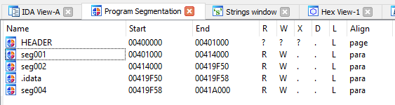

Выглядит как будто использовался упаковщик. Чтобы развеять наши сомнения, воспользуемся утилитой PEiD.

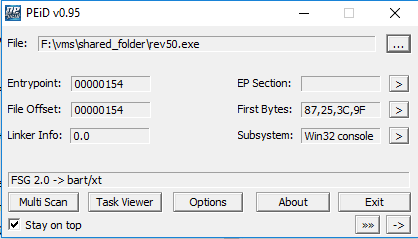

Да, использовался упаковщик FSG версии 2. Значит будем распаковывать. Поможет нам в этом OllyDbg первой версии и ее плагин OllyDump. Но OllyDbg я использовал только для того, чтобы сдампить процесс. Динамический анализ я проводил в более удобном отладчике x64dbg.

Для распаковки нам понадобится найти место в коде, где вызывается функция GetProcAddress. Ставим брейк на ней. 

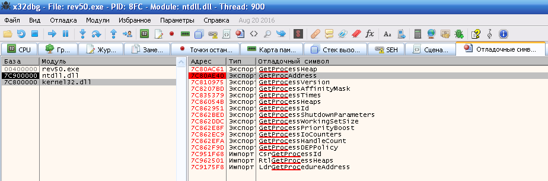

Запускаем программу. Через некоторое время мы окажемся в начале функции GetProcAddress.

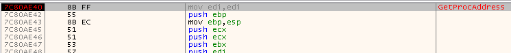

Жмем кнопку «Выполнить до возврата» и еще раз кнопку «Шаг с обходом».

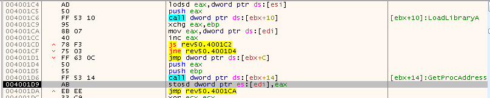

Мы оказались в той части кода, которая осуществляет динамический импорт внешних функций. Мы можем прочитать данный кусок ассемблерного кода и увидеть, что когда импорт закончится, то выполнится команда по адресу 0x4001D1. Поставим на нее брейк, снимем брейк с GetProcAddress и продолжим выполнение.

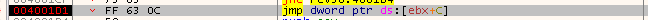

Сейчас мы остановились. Жмем кнопку «Шаг с обходом» и оказываемся по адресу 0x401000. Это начало настоящей программы. Теперь проделываем тоже самое в Olly (ставим брейки по уже известным адресам)

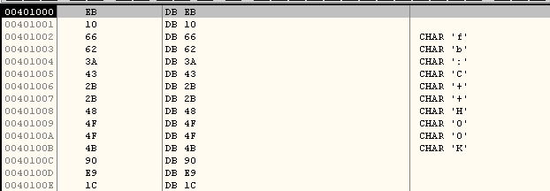

Olly автоматически не проанализировала данный кусок кода, потому что изначально там были только данные. ПКМ -> Analysis -> Analyze code.

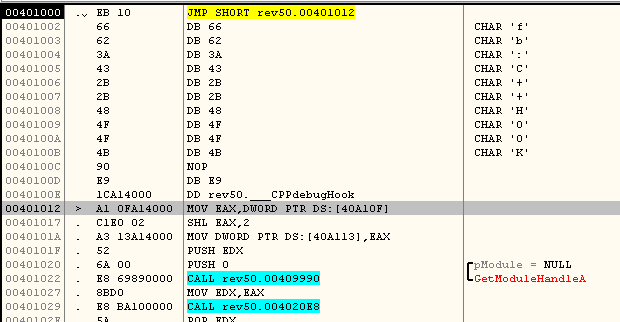

Воспользуемся плагином OllyDump

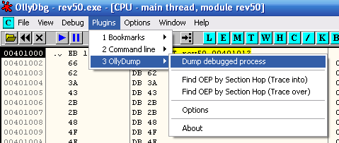

Ничего не трогаем и жмем Dump

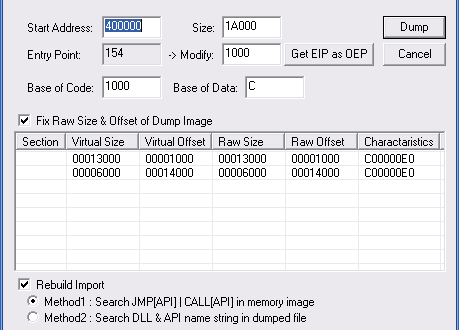

Нас попросят ввести имя файла. Откроем распакованный файл в IDA.

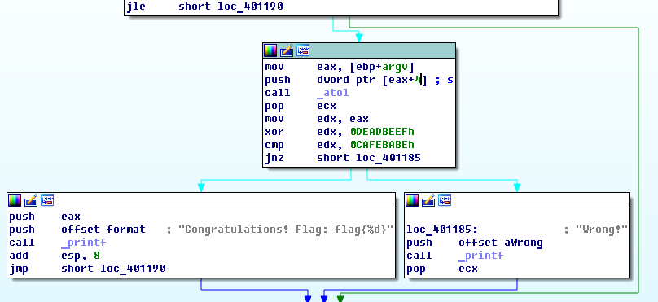

По графу можно определить, что программа ждет числовой аргумент.  Чтобы мы получили флаг, нам нужно, чтобы аргумент XOR 0xDEADBEEF был равен 0xCAFEBABE. Считаем и получем флаг.

Флаг: flag{340984913}
